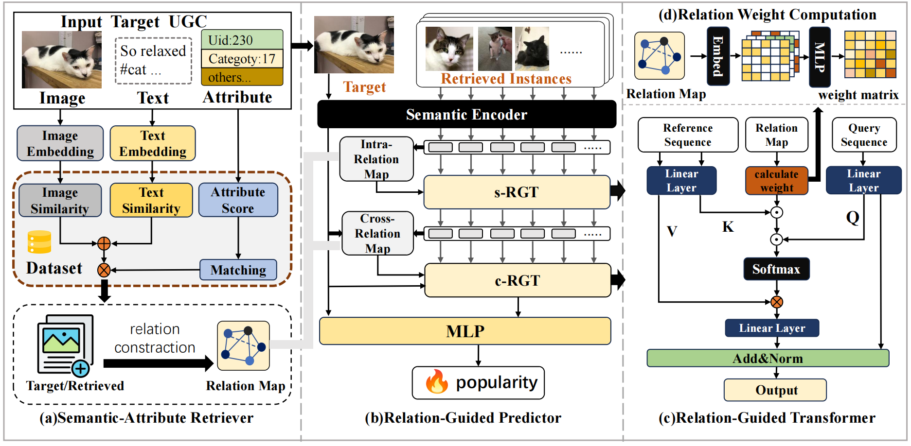

# RE-RAG: Relation-Enhanced Retrieval-Augmented Framework for SMPP

Official implementation of **RE-RAG**, proposed in:

**Enhancing Relation Modeling with Social Attributes for Social Media Popularity Prediction**

- Paper: https://arxiv.org/abs/2607.19200
- Venue: ACM Multimedia 2026

<p align="center">
  
</p>

## Overview

Social Media Popularity Prediction (SMPP) aims to predict the future popularity of user-generated content (UGC). Existing retrieval-based methods mainly rely on semantic similarity while overlooking the propagation patterns reflected by social attributes.

We propose **RE-RAG**, a relation-enhanced retrieval-augmented framework that models UGC similarity through both semantic content and social attributes. RE-RAG consists of a **Semantic-Attribute Retriever (SAR)** for retrieving relevant instances and a **Relation-Guided Predictor (RGP)** for relation-aware popularity prediction.


## Dataset

Download datasets and organize them as:

| Dataset | Source | Link |
|---|---|---|
| ICIP | Flickr | http://www.visiongarage.altervista.org/popularitydataset/ |
| SMPD | Flickr | https://smp-challenge.com |
| SMTPD | YouTube | https://github.com/zhuwei321/SMTPD |


## Environment

Install dependencies:

```bash
pip install -r requirements.txt
```


## Data Preparation

Run the following scripts sequentially:

```bash
# 1. Build structured metadata
python process/process.py

# 2. Extract multimodal embeddings
python process/embed.py

# 3. Compute rarity-enhanced attributes
python process/rarity.py

# 4. Generate retrieval candidates
python process/query.py
```


## Training

Example training command on SMPD:

```bash
python train.py \
  --way train \
  --data_files ../dataset/smpd/dataset_q.pkl
```


## Evaluation

Evaluate using a trained checkpoint:

```bash
python train.py \
  --way test \
  --data_files ../dataset/smpd/dataset_q.pkl \
  --checkpoint /path/to/best_model.pth
```


## Output

Training logs and checkpoints are saved under:

```text
out/log/<timestamp+model_name>/
```

Evaluation metrics:

- MSE
- MAE
- SRC (Spearman Rank Correlation)
- nMSE


## Citation

If you find this work useful, please cite:

```bibtex
@inproceedings{zheng2026rerag,
  title={Enhancing Relation Modeling with Social Attributes for Social Media Popularity Prediction},
  author={Zheng, Bolun and Luo, Yuhao and Zhu, Wei and Xu, Ning and Liu, Anan},
  booktitle={Proceedings of the ACM Multimedia Conference},
  year={2026}
}
```# RE_RAG
